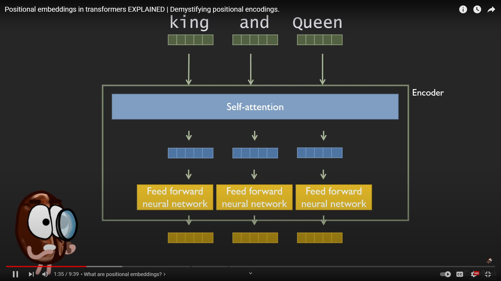

estimated time: 7:30 hrs 

# LLM fundamentals, Token and Positional Embeddings

- Finished Chapter 1,2 of [Build a Large Language Model (From Scratch)](https://www.manning.com/books/build-a-large-language-model-from-scratch)

- Read about Mistral's tokenizer 
https://docs.mistral.ai/guides/tokenization/

- comperhensive introduction to the positional encoding [Transformer Architecture: The Positional Encoding](https://kazemnejad.com/blog/transformer_architecture_positional_encoding/)

- 🎥 watched 
    - [A Deep Dive: Embeddings, Vectors & Search Algorithms in LLM's](https://www.youtube.com/watch?v=WumStBfoArc)
    

    -  [Positional embeddings in transformers EXPLAINED | Demystifying positional encodings.](https://www.youtube.com/watch?v=1biZfFLPRSY)
    

    -   [Positional Encoding in Transformer Neural Networks Explained](https://www.youtube.com/watch?v=ZMxVe-HK174)

## Notes

most of the images in these notes are property of [Build a Large Language Model (From Scratch)](https://www.manning.com/books/build-a-large-language-model-from-scratch)

