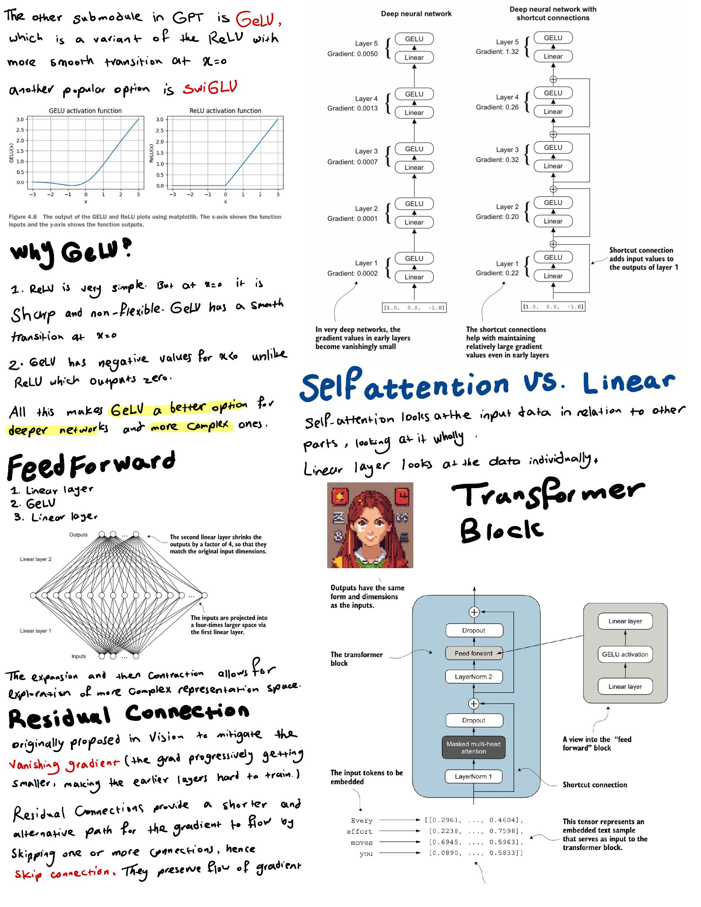
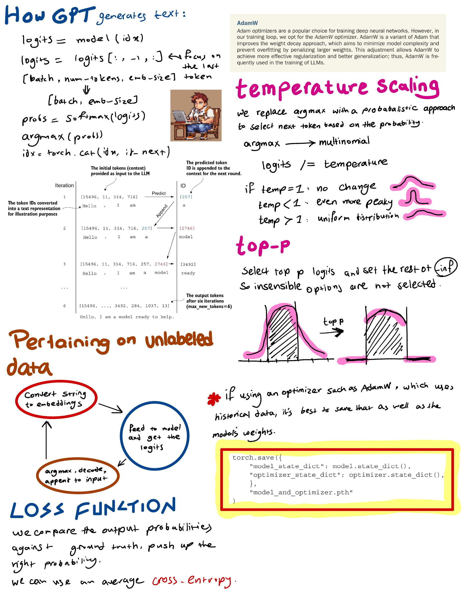

estimated time: 5 hrs

#  GPT and Fine-Tuning!

- finished chapter 4 and 5 of [Build a Large Language Model (From Scratch)](https://www.manning.com/books/build-a-large-language-model-from-scratch)

- started chapter 6

## Notes

most of the images in these notes are property of [Build a Large Language Model (From Scratch)](https://www.manning.com/books/build-a-large-language-model-from-scratch)

