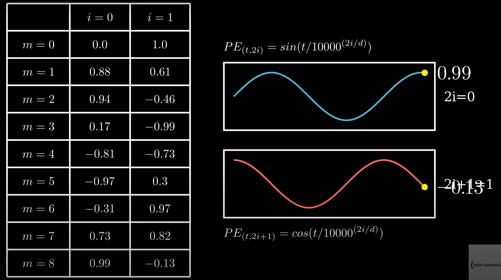

estimated time: *** hrs

# 

## ROPE

- [RoPE (Rotary positional embeddings) explained: The positional workhorse of modern LLMs](https://www.youtube.com/watch?v=GQPOtyITy54)

- [Rotary Positional Embeddings: Combining Absolute and Relative](https://www.youtube.com/watch?v=o29P0Kpobz0&t=82s)

## Notes

