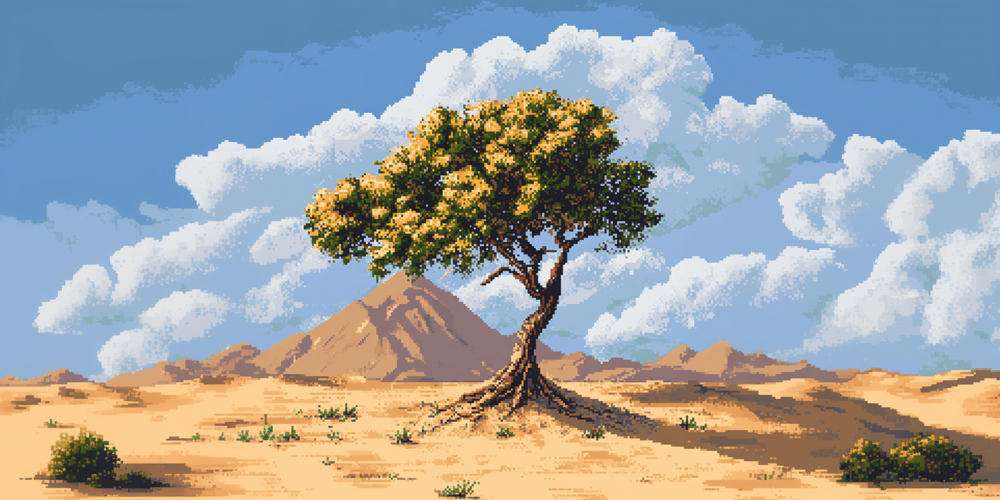
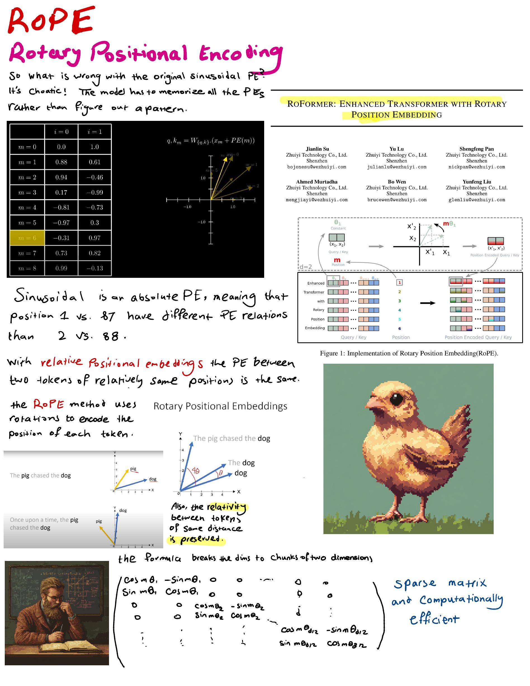
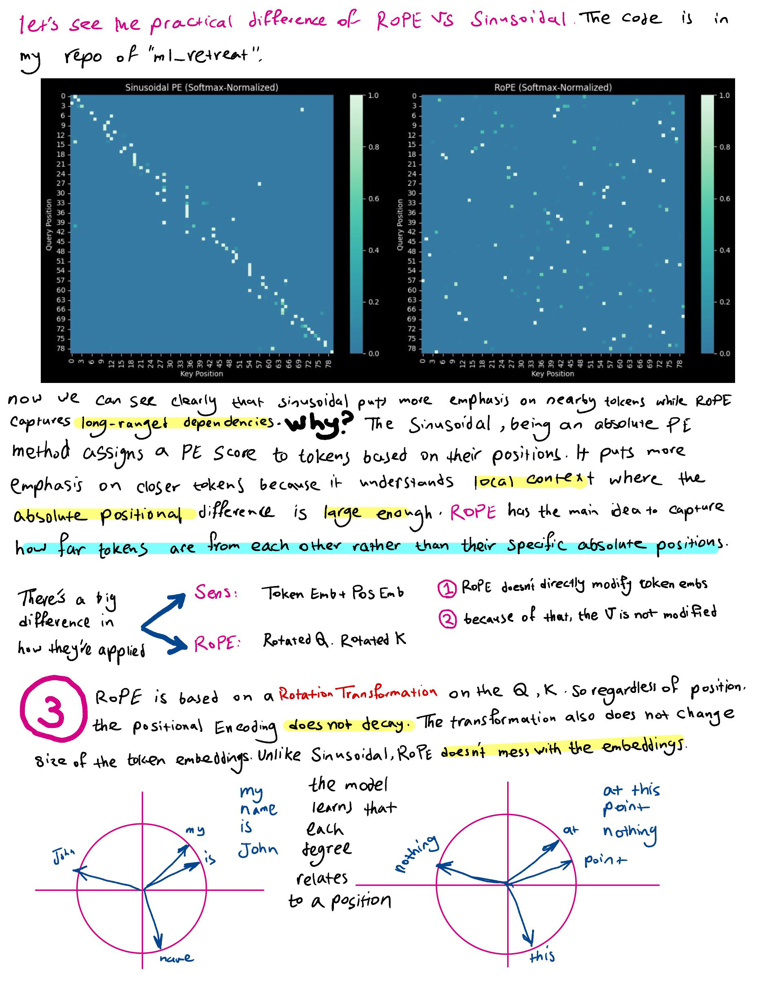
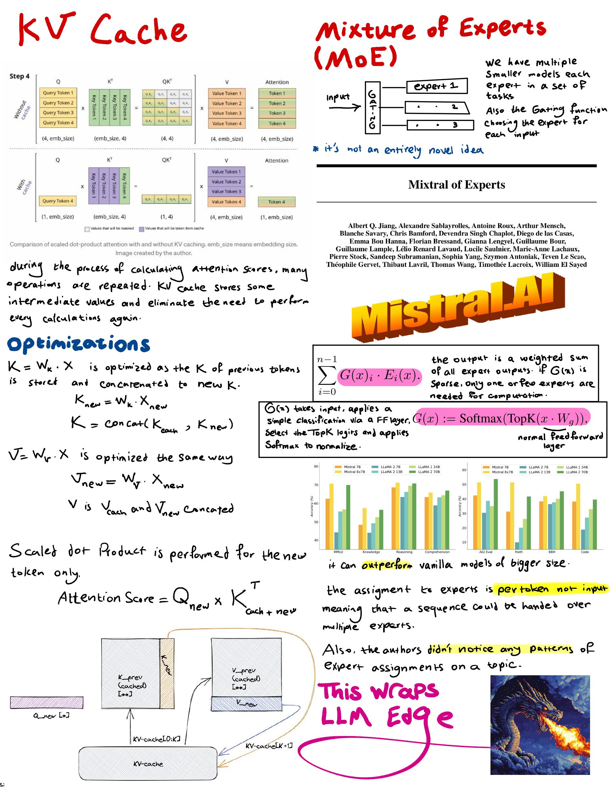

estimated time: 6:30 hrs

# KV Cache, Mixture of Experts

### KV Cache

For KV Cache I mainly learned using ChatGPT, I hope my notes are helpful enough for you. 

### MoE

- [Mistral 8x7B Part 1- So What is a Mixture of Experts Model?](https://www.youtube.com/watch?v=RYZ0FMAKRFs)

- [Mixtral of Experts (Paper Explained)](https://www.youtube.com/watch?v=mwO6v4BlgZQ)

**this is a wrap on the major LLM topics, next step is to recap all what we learned. reviewing llama architecture is the best way to do this.**

### Llama

- [LLaMA explained: KV-Cache, Rotary Positional Embedding, RMS Norm, Grouped Query Attention, SwiGLU](https://www.youtube.com/watch?v=Mn_9W1nCFLo)

- watched [Let's build GPT: from scratch, in code, spelled out.](https://www.youtube.com/watch?v=kCc8FmEb1nY&list=PLAqhIrjkxbuWI23v9cThsA9GvCAUhRvKZ&index=7)

## Notes

