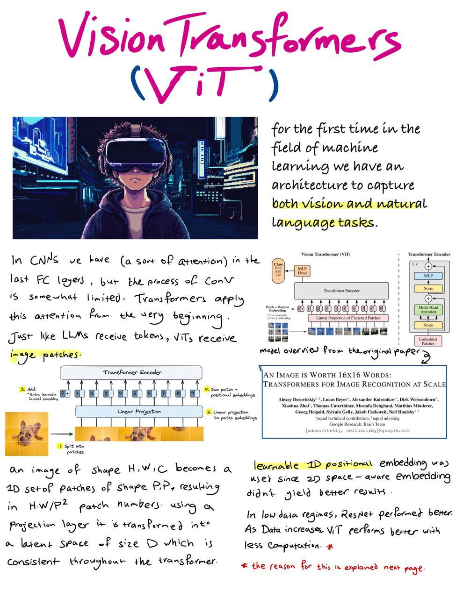
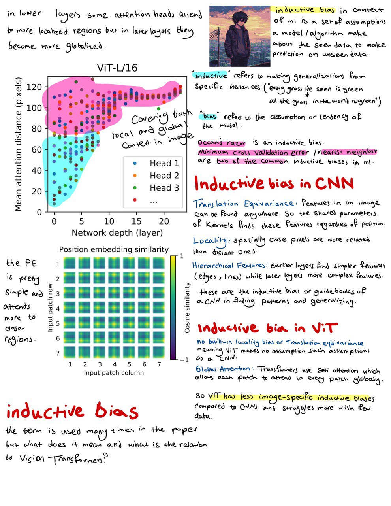

estimated time: 6 hrs

# Vision Transformers (ViT)

-  [Vision Transformers (ViT) Explained + Fine-tuning in Python](https://www.youtube.com/watch?v=qU7wO02urYU)

- [An Image is Worth 16x16 Words: Transformers for Image Recognition at Scale (Paper Explained)](https://www.youtube.com/watch?v=TrdevFK_am4)

- [Vision Transformer (ViT) - An image is worth 16x16 words | Paper Explained](https://www.youtube.com/watch?v=j6kuz_NqkG0)

- original ViT paper: [An Image is Worth 16x16 Words: Transformers for Image Recognition at Scale](https://arxiv.org/abs/2010.11929)

- additional read on ViT [Vision Transformer (ViT)](https://aman.ai/primers/ai/vit/)

- [Implement and Train ViT From Scratch for Image Recognition - PyTorch](https://www.youtube.com/watch?v=Vonyoz6Yt9c)

## Notes

