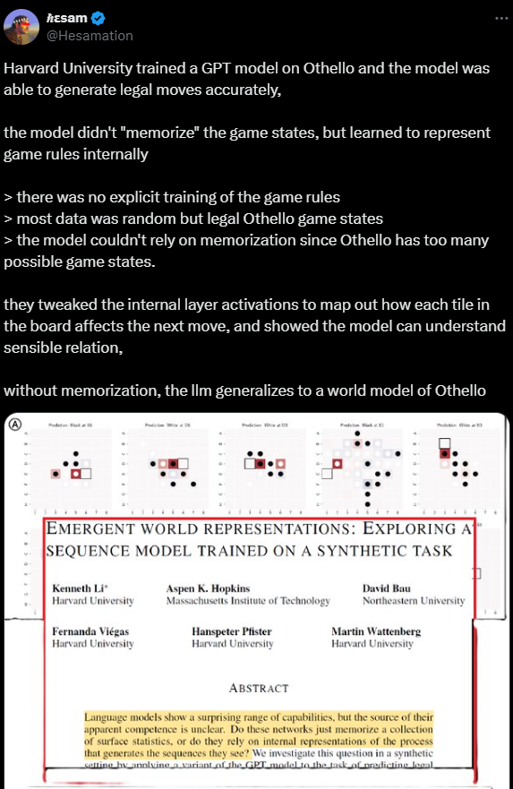

estimated time: 6 hrs

# LLM and Natural Language Understanding

- read the paper [Emergent World Representations: Exploring a Sequence Model Trained on a Synthetic Task](https://arxiv.org/abs/2210.13382) 

- read the paper [Climbing towards NLU: On Meaning, Form, and Understanding in the Age of Data](https://aclanthology.org/2020.acl-main.463/) which claims LLMs are incapable of understanding natural language since they only learn the "form" and not the "meaning"

- read about the chinese room argument (up to the point of the System Reply because it already seemed obvious from the start) [The Chinese Room Argument
](https://plato.stanford.edu/entries/chinese-room/#Over)

- read [Provable Limitations of Acquiring Meaning from Ungrounded Form: What Will Future Language Models Understand?](https://arxiv.org/abs/2104.10809)

