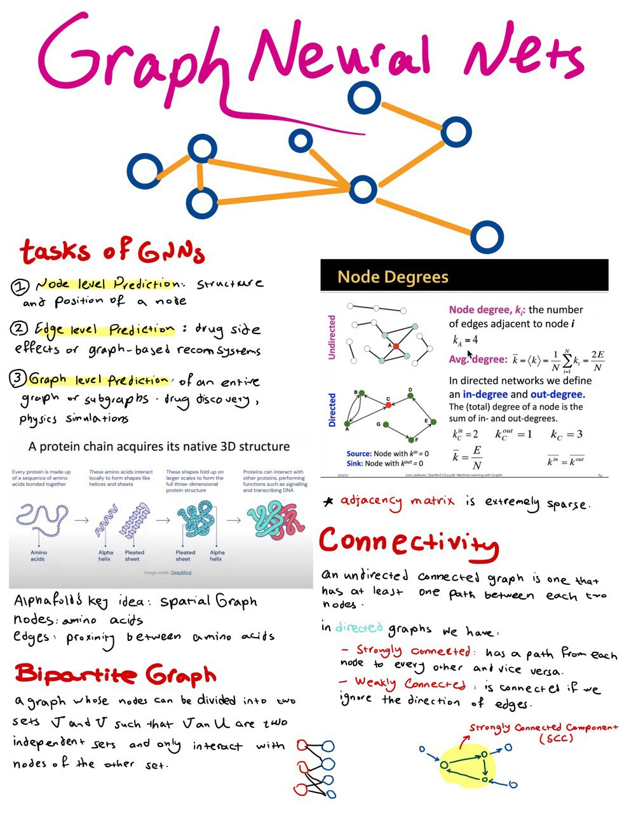
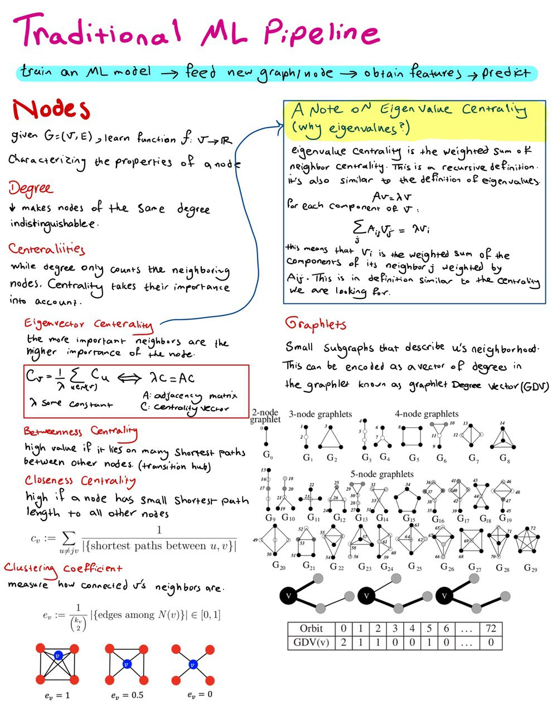
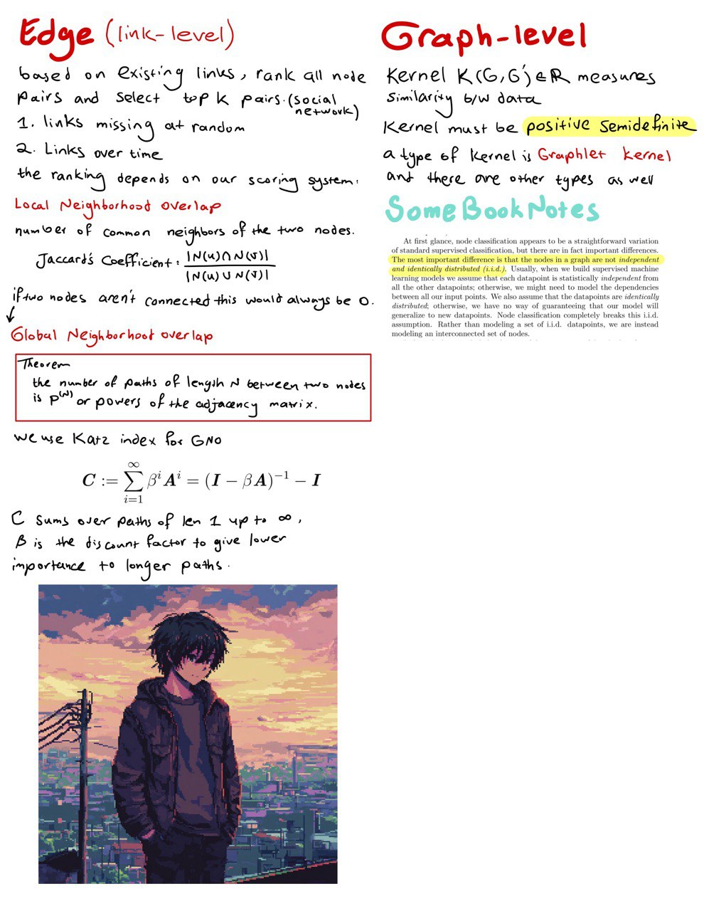

estimated time: *** hrs

# Graph Neural Networks

- Stanford CS224W: Machine Learning with Graphs Lecture
    - lectures 1 & 2
    
- Graph Representation Learning Book
    - chapters 1 & 2 (skip the ones not taught in the course above)

## Notes

