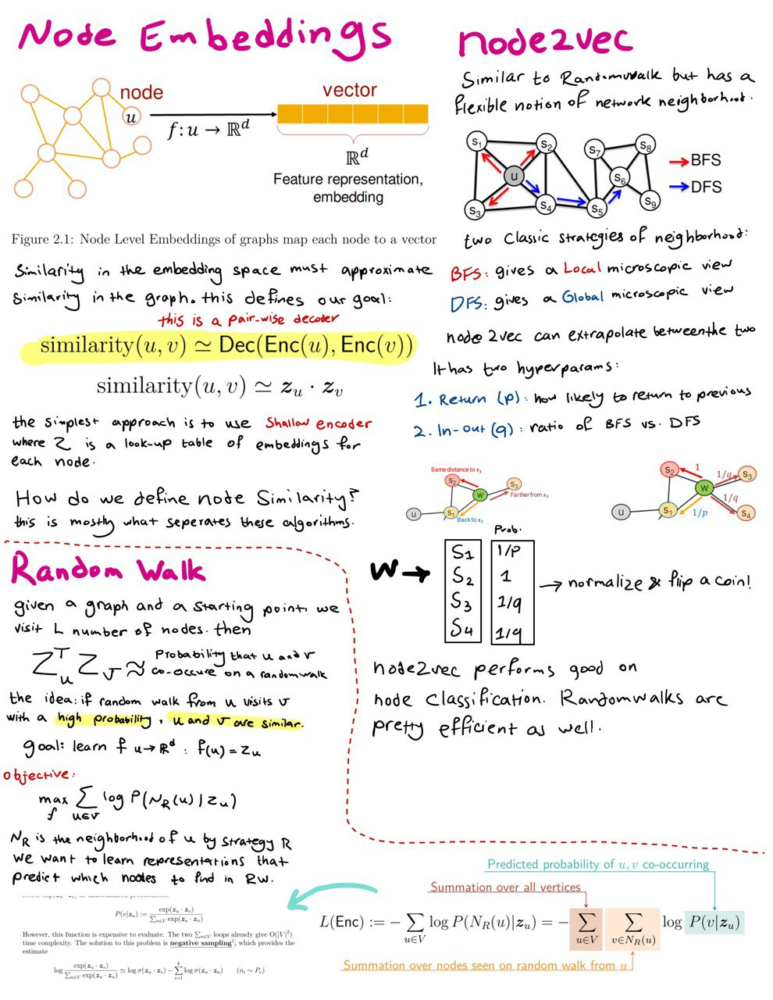
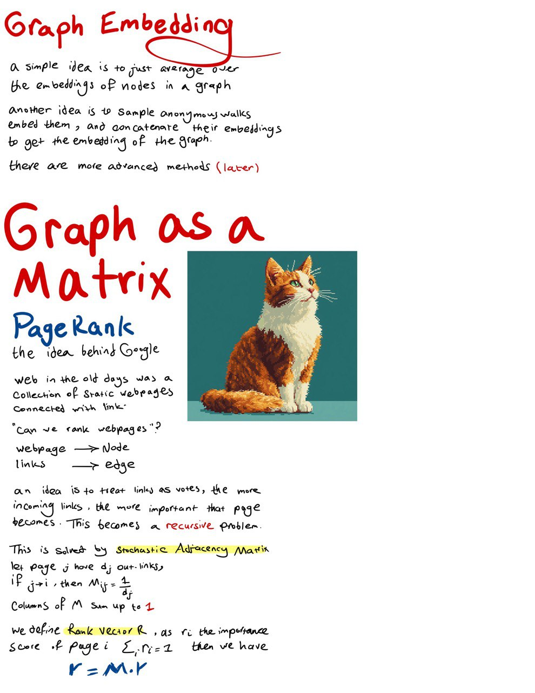
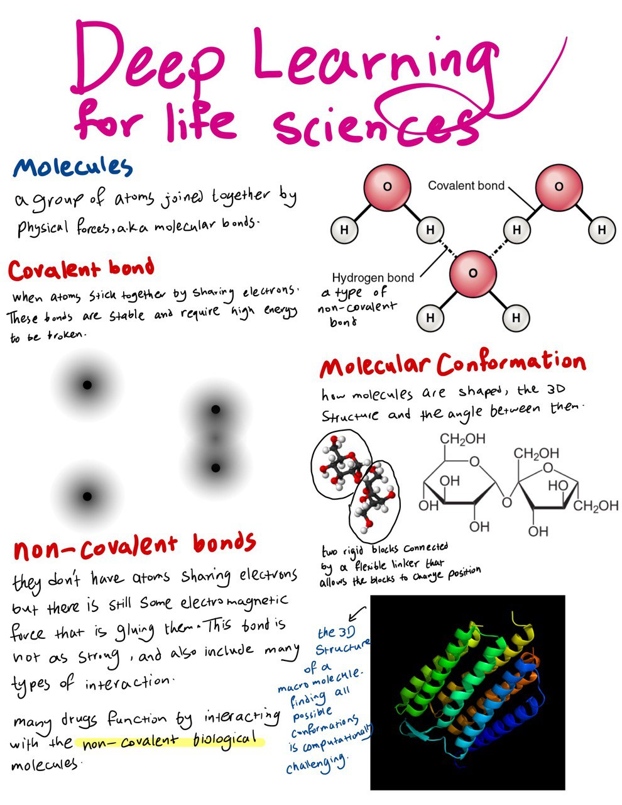

estimated time: 4 hrs

# Graph Neural Networks

- Stanford CS224W: Machine Learning with Graphs Lecture
    - lectures 3 and 4.1
    
- Graph Representation Learning Book
    - Chapter 3 **up to 3.2** 

- Deep Learning for the Life Sciences Book
    - Chapter 4: Molecular ML up to Extended Connectivity Fingerprints

## Notes

