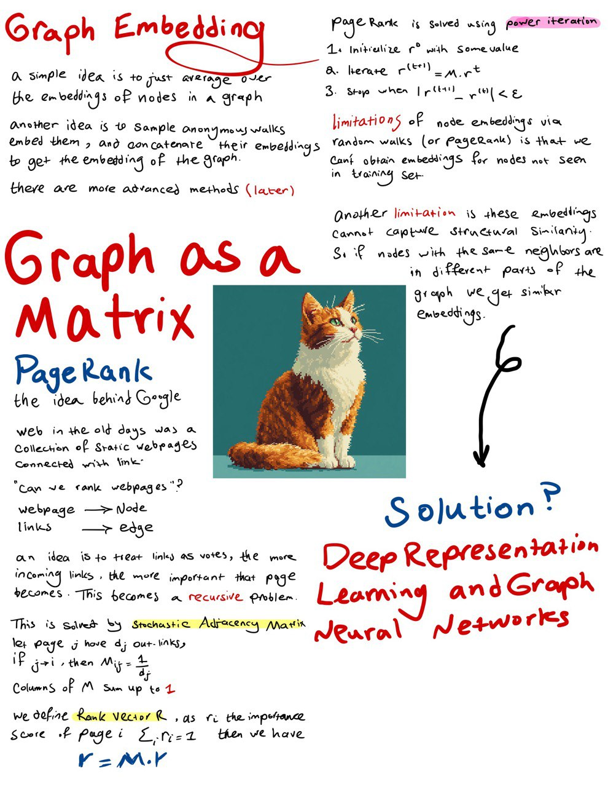
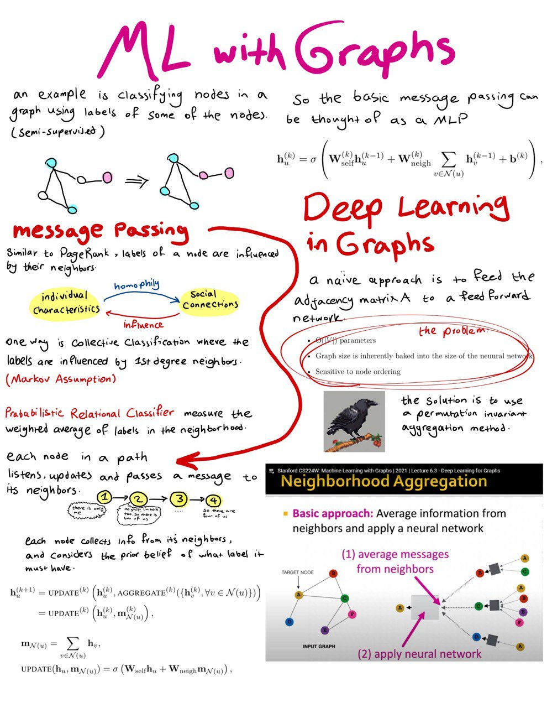

estimated time: 6 hrs

# Graph Neural Networks

- Stanford CS224W: Machine Learning with Graphs Lecture
    - lectures 4, 5, 6
    
- Graph Representation Learning Book
    - Read until 5.2.2

- Deep Learning for the Life Sciences Book
    - Read until Protein Structures Chapter 5

## Notes

