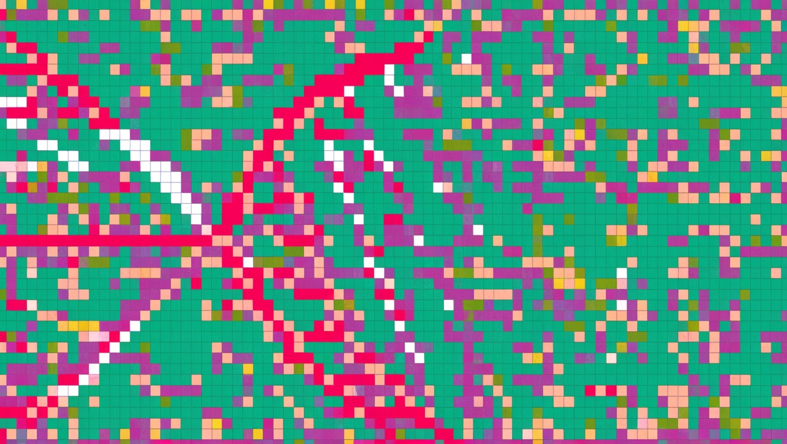
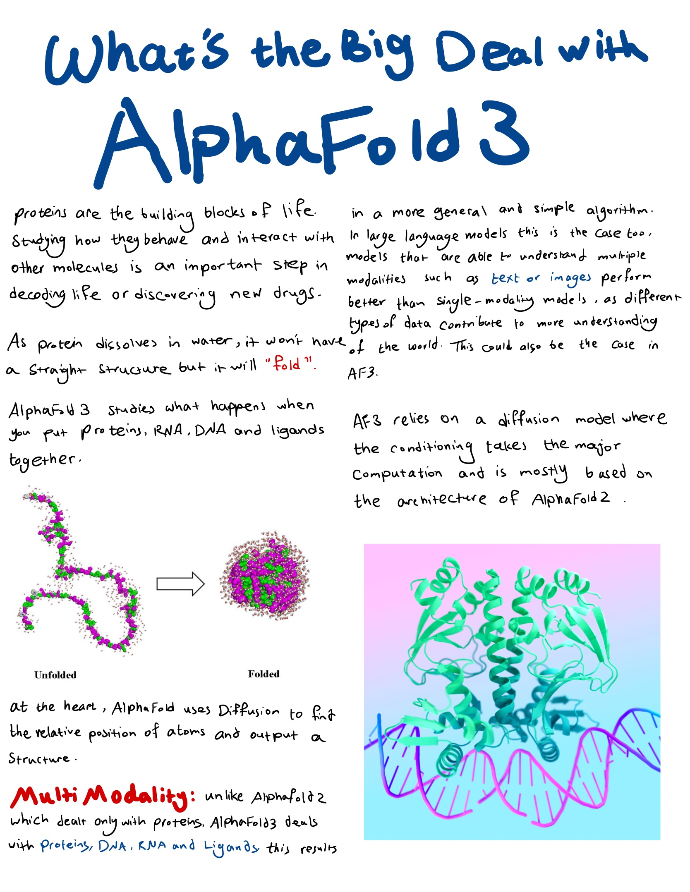
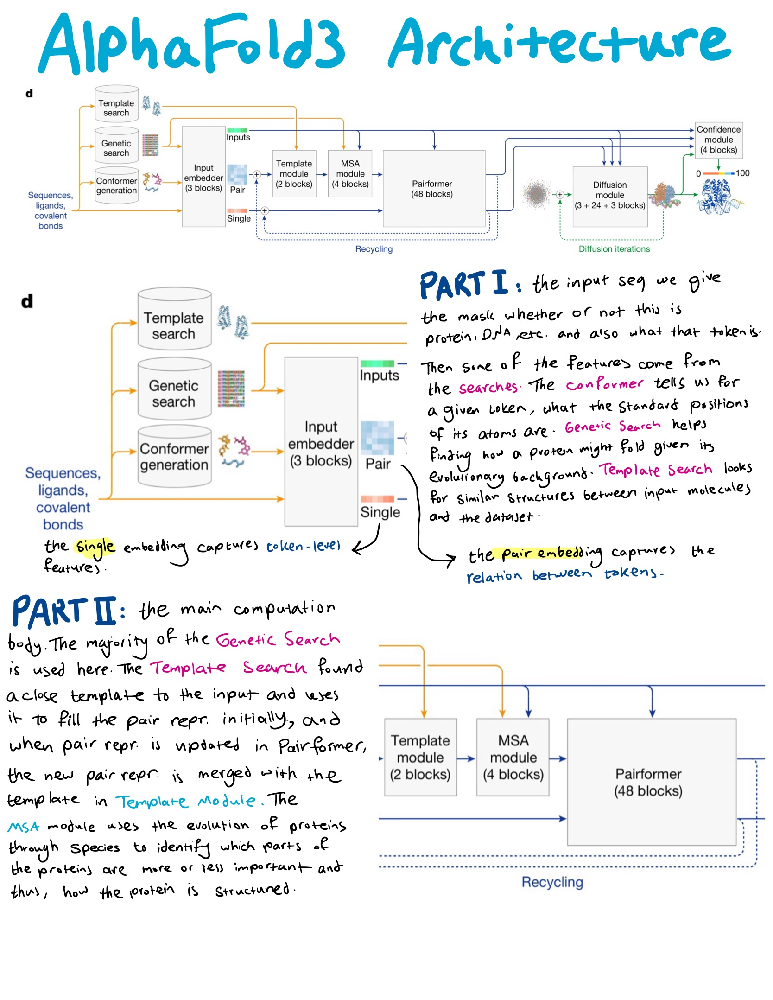
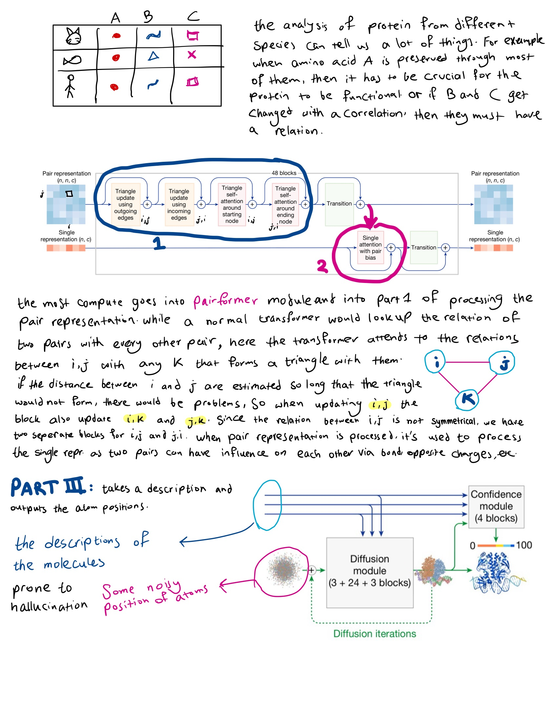

estimated time: 7 hrs

# AlphaFold and what the big deal is

- an introduction to proteins and why they fold [Protein Structure and Folding](https://www.youtube.com/watch?v=hok2hyED9go)

- [AlphaFold 3 deep dive](https://www.youtube.com/watch?v=Or3iq4_9-wA)

- [The brilliance of AlphaFold 3](https://www.youtube.com/watch?v=CYncNBMPLLk)

- [how AlphaFold *actually* works](https://www.youtube.com/watch?v=3gSy_yN9YBo)

- AlphaFold [Paper](https://www.nature.com/articles/s41586-024-07487-w#MOESM1) and [Supplementary Information](https://static-content.springer.com/esm/art%3A10.1038%2Fs41586-024-07487-w/MediaObjects/41586_2024_7487_MOESM1_ESM.pdf)

my full explanation of the architecture: https://x.com/Hesamation/status/1866231176182009968

## Notes

