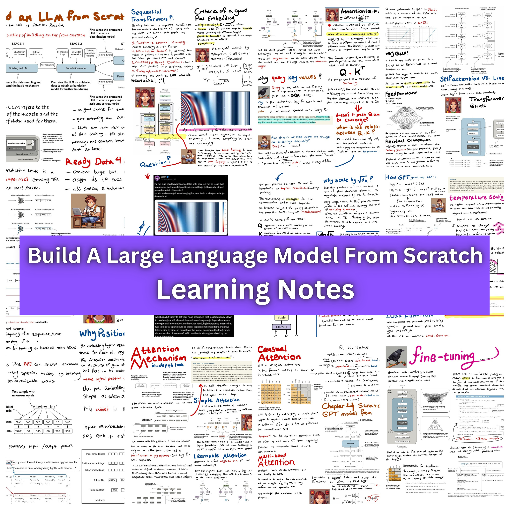
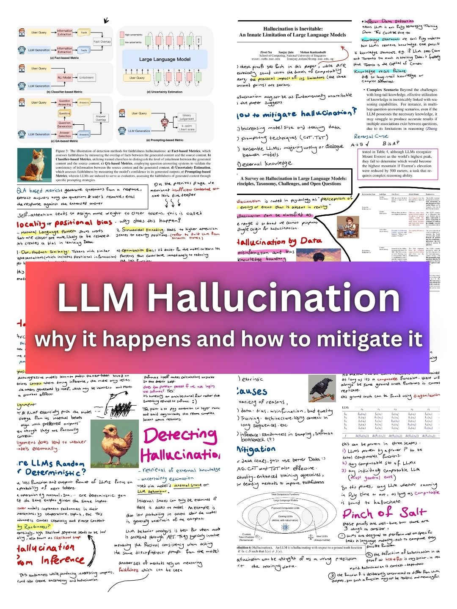
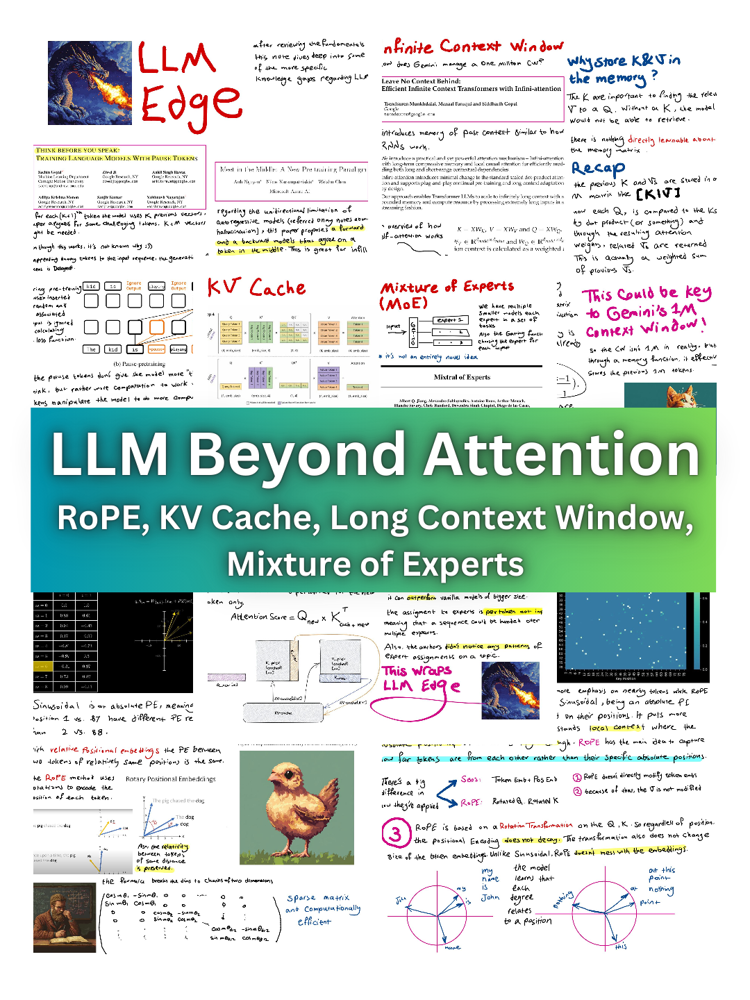
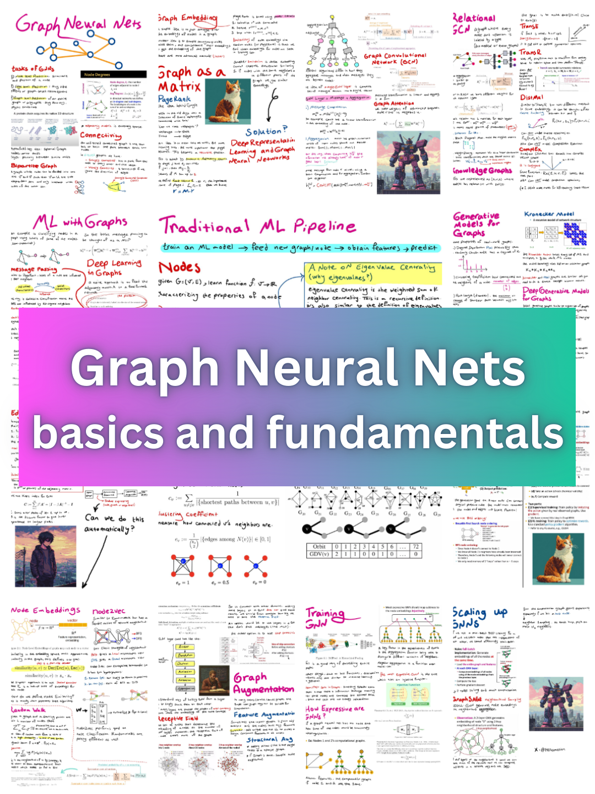
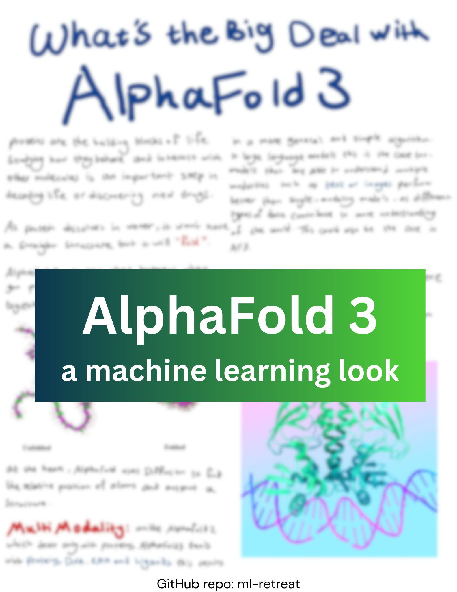

# ML Retreat: Advanced ML Learning Journal

**Current Grind: Mechanistic Interpretability**

This repository is my personal journal of learning advanced topics in machine learning. It includes an in-depth understanding of fundamentals + additional must-read/watch recourses for more nuanced subjects.

  

## 📝 My Notes

  <table>
    <tr>
      <td>
        
         
        <a href="assets/LLM-from-scratch-notes.pdf">Build an LLM from Scratch</a>
      </td>
      <td>
        
         
        <a href="assets/LLM-Hallucination.pdf">LLM Hallucination</a>
      </td>
      <td>
        
         
        <a href="assets/LLM-Edge-Beyond-Attention.pdf">LLM Edge: Beyond Attention</a>
      </td>
    </tr>
    <tr>
      <td>
        
         
        <a href="assets/introduction-to-GNN.pdf">Introduction to GNNs</a>
      </td>
      <td>
        
         
        <a href="assets/AlphaFold3.pdf">AlphaFold3: a machine learning look</a>
      </td>
      <td>
        
         
        <a href="assets\Natural-Language-Processing.pdf">Natural Language Processing</a>
      </td>
    </tr>
  </table>

## 📕 Table of Content
If you go to th [Days Folder](Days/) you can find a list of all the topics I have covered. However, for easier access to a specific subject, check out this table to find which days to go through.

  <table border="1">
    <tr>
      <th>Subject</th>
      <th>Check out:</th>
    </tr>
    <tr>
      <td>Large Language Models</td>
      <td>from <a href="Days\003 (llm fundamentals, pos embedding)">Day 003</a> to <a href="Days\016 (Multi Modal LM)">Day 016</a></td>
    </tr>
    <tr>
      <td>Graph Neural Networks</td>
      <td>from <a href="Days\017 (GNN)">Day 017</a>  to <a href="Days\022 (GNN)">Day 022</a></td></td>
    </tr>
    <tr>
      <td>AlphaFold 3</td>
      <td><a href="Days\023 (AlphaFold)">Day 23</a></td>
    </tr>
  </table>

## 🎯 Goals

My goals of this learning retreat includes studying: 

- [Ilya Sutskever's top 30 must-read research papers](https://aman.ai/primers/ai/top-30-papers/)
- [Most of Distilled AI's Blogs](https://aman.ai/primers/ai/)
- [Artem Kirsanov's AI/ML Playlist](https://www.youtube.com/playlist?list=PLgtmMKe4spCPsxyMpg-sxf3EcbsFYlzPK)
- [Andrej Karpathy's golden Neural Net Playlist](https://www.youtube.com/playlist?list=PLAqhIrjkxbuWI23v9cThsA9GvCAUhRvKZ)
- In-depth understanding/implementations of Transformers
- LLMs and related topics ✅
- LLM Halucination in depth ✅
- Quantum Machine Learning
- Jax
- Energy-Based Models